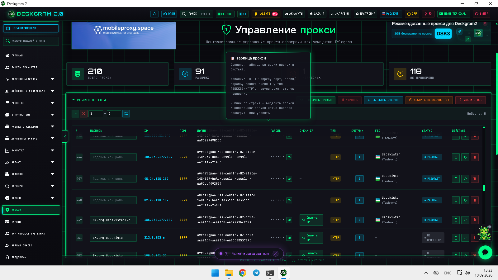
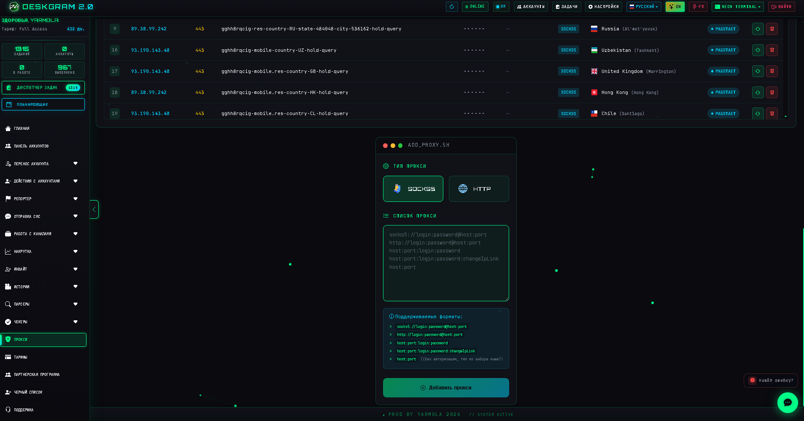

# Proxy Manager для Telegram в Deskgram 2

`Управление прокси` — это инфраструктурный раздел Deskgram 2 для хранения, массового добавления и проверки прокси, используемых Telegram-аккаунтами. Он нужен, когда вы строите устойчивую рабочую среду под рассылки, инвайт, парсинг и другие сценарии.

[Главный хаб Deskgram 2](https://github.com/Deskgram-2/deskgram-2-telegram-automation) · [Сайт](https://deskgram2.com/) · [Telegram-бот](https://t.me/DG2welcomebot) · [Web preview](https://deskgram2.com/web-preview)
## Интерактивный Web Preview

Попробовать модуль в браузере: [Открыть веб-превью](https://deskgram2.com/web-preview?path=%2Fapp-demo%2Ffunctions%2Fproxy)

## Кратко о разделе

| Параметр | Что внутри |
|---|---|
| Основная задача | Хранение, импорт и проверка прокси для Telegram-аккаунтов |
| Поддерживаемые типы | `SOCKS5`, `HTTP` |
| Что помогает делать | Готовить рабочий пул прокси под другие модули |
| Полезен для | Аккаунтных сеток, рассылок, инвайта, парсинга |
| Связанные разделы | Панель аккаунтов, Рассылка в ЛС, Инвайт |

## Что умеет раздел

- показывать общую таблицу прокси;
- массово добавлять прокси из списка;
- поддерживать несколько форматов строк;
- хранить статусы проверки;
- проверять выбранные или все прокси;
- удалять нерабочие записи;
- использовать прокси как часть общей инфраструктуры Deskgram 2.

## Быстрый старт

1. Подготовьте список прокси.
2. Выберите тип или используйте автоопределение.
3. Добавьте записи в базу.
4. Запустите проверку.
5. Используйте рабочий пул в аккаунтах и модулях.

## В какие сценарии это обычно переходит

- [Рассылка в ЛС](https://github.com/Deskgram-2/telegram-direct-messaging-deskgram), если нужен стабильный outreach по аккаунтной сетке;
- [Инвайт](https://github.com/Deskgram-2/telegram-invite-tool-deskgram), если база и аккаунты уже готовы к приглашениям;
- [Сбор аудитории](https://github.com/Deskgram-2/telegram-audience-parser-deskgram), если вы сначала строите источник данных;
- [Вступление в группы](https://github.com/Deskgram-2/telegram-join-groups-deskgram), если инфраструктура нужна для аккаунтной активности;
- [Панель аккаунтов](https://github.com/Deskgram-2/telegram-account-manager-deskgram), если хотите сначала связать рабочие прокси с нужной группой аккаунтов.

## Интерфейс раздела

### Таблица прокси

Основная таблица показывает IP, порт, тип, геолокацию и статус проверки.

### Форма добавления

Через форму можно импортировать список прокси и сразу указать нужный тип.

## Когда особенно полезен

- когда вы ведете несколько Telegram-аккаунтов;
- когда нужно быстро чистить и обновлять пул прокси;
- когда важна централизованная инфраструктура для рабочих модулей;
- когда прокси используются сразу в нескольких сценариях.

## Почему это удобнее ручного ведения

| Ручной подход | Proxy Manager в Deskgram 2 |
|---|---|
| Прокси лежат в разрозненных файлах | Есть единая таблица внутри программы |
| Сложно быстро проверить весь список | Есть массовая проверка |
| Нерабочие записи остаются в базе | Их можно быстро отфильтровать и удалить |
| Форматы нужно нормализовать руками | Поддерживается несколько форматов ввода |
| Нет связи с другими модулями | Прокси встроены в общий рабочий контур |

## Сценарии применения

- подготовка рабочего пула под [рассылку в ЛС](https://github.com/Deskgram-2/telegram-direct-messaging-deskgram), когда важна стабильная инфраструктура на несколько аккаунтов;
- сбор и проверка резерва перед [инвайтом](https://github.com/Deskgram-2/telegram-invite-tool-deskgram) и [вступлением в группы](https://github.com/Deskgram-2/telegram-join-groups-deskgram), если впереди активные growth-сценарии;
- обслуживание базы прокси перед [сбором аудитории](https://github.com/Deskgram-2/telegram-audience-parser-deskgram), когда вы строите цепочку `discovery -> parser -> outreach`;
- централизованная ротация и очистка пула, если одна и та же инфраструктура используется сразу в нескольких сценариях Deskgram 2.

## Что выбрать: сначала прокси или сначала панель аккаунтов

| Если ваша задача | С чего начать |
|---|---|
| Собрать и структурировать рабочую базу аккаунтов | С [панели аккаунтов](https://github.com/Deskgram-2/telegram-account-manager-deskgram) |
| Проверить инфраструктуру под нагрузку и убрать нерабочие точки | С `Proxy Manager` |
| Готовить сетку под массовые сценарии, где важна и база, и стабильное соединение | С панели аккаунтов, а затем сразу переходить в `Proxy Manager` |
| Выровнять систему перед запуском нескольких модулей | Сначала аккаунты и прокси, потом [настройки](https://github.com/Deskgram-2/telegram-automation-settings-deskgram) |

## Смежные репозитории

- [Главный хаб Deskgram 2](https://github.com/Deskgram-2/deskgram-2-telegram-automation)
- [Рассылка в ЛС](https://github.com/Deskgram-2/telegram-direct-messaging-deskgram)
- [Инвайт](https://github.com/Deskgram-2/telegram-invite-tool-deskgram)
- [Сбор аудитории](https://github.com/Deskgram-2/telegram-audience-parser-deskgram)
- [Вступление в группы](https://github.com/Deskgram-2/telegram-join-groups-deskgram)
- [Панель аккаунтов](https://github.com/Deskgram-2/telegram-account-manager-deskgram)

## FAQ

### Какие типы прокси поддерживаются?

Основной упор идет на `SOCKS5` и `HTTP`.

### Нужно ли проверять прокси после импорта?

Да. Это лучший способ сразу отделить рабочие записи от невалидных.

### Можно ли добавлять список массово?

Да. Раздел как раз рассчитан на пакетное добавление и дальнейшую проверку.

### С чем помогает этот раздел в общей работе?

Он помогает подготовить рабочую инфраструктуру для аккаунтов и модулей, которым нужны стабильные и проверенные прокси.

## Полезные ссылки

- [Главный хаб Deskgram 2](https://github.com/Deskgram-2/deskgram-2-telegram-automation)
- [Сайт Deskgram 2](https://deskgram2.com/)
- [Telegram-бот Deskgram 2](https://t.me/DG2welcomebot)
- [Web preview](https://deskgram2.com/web-preview)
